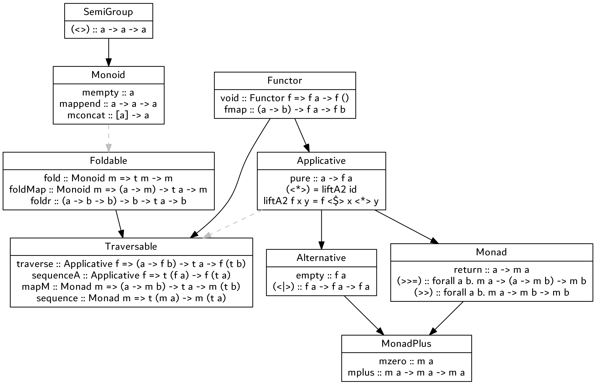

# Repositorium ad Haskellem demonstrandum.

Repositorium quo fontes in Haskelle scripti collecti sunt.

[](https://travis-ci.org/fuszenecker/HaskellDemo)

## Generalia

```
{-# LANGUAGE OverloadedStrings #-}
```

```
GHCi> :set -XTypeApplications
GHCi> :type fmap @Maybe
fmap @Maybe :: (a -> b) -> Maybe a -> Maybe b
```



## Semigroup atque Monoid

```
class Semigroup a where
  (<>) :: a -> a -> a

class Semigroup a => Monoid a where
  mempty :: a
  mappend :: a -> a -> a
  mconcat :: [a] -> a
```

### All et Any

```
newtype All = All {getAll :: Bool}
instance Monoid All

newtype Any = Any {getAny :: Bool}
instance Monoid Any
```

Exampli gratia:

```
GHCi> Any True <> Any True <> Any False
Any {getAny = True}

GHCi> All True <> All True <> All False
All {getAll = False}

GHCi> Sum 10 <> Sum 20 <> Sum 30
Sum {getSum = 60}

GHCi> Product 10 <> Product 20 <> Product 30
Product {getProduct = 6000}

GHCi> mconcat [All True, All True, All False]
All {getAll = False}

GHCi> mconcat [Any True, Any True, Any False]
Any {getAny = True}
```

Monoides monoidum:

```
GHCi> mconcat [Just $ Sum 10, Just $ Sum 20, Just $ Sum 30]
Just (Sum {getSum = 60})

GHCi> mconcat [Just $ Sum 10, Nothing, Just $ Sum 30]
Just (Sum {getSum = 40})

GHCi> mconcat [Just $ Sum 10, mempty, Just $ Sum 30]
Just (Sum {getSum = 40})
```

## Functor

```
class Functor (f :: * -> *) where
  fmap :: (a -> b) -> f a -> f b
  (<$) :: a -> f b -> f a
```

Exampli gratia:

```
GHCi> fmap (*10) [1, 2, 3, 4, 5]
[10,20,30,40,50]

GHCi> 10 <$ [1, 2, 3, 4, 5]
[10,10,10,10,10]

GHCi> fmap (*10) $ Just 20
Just 200

GHCi> 10 <$ Just 0
Just 10
```

Functiones quoque functores sunt:

```
GHCi> fmap (*2) (+10) 5
30
GHCi> (*2) . (+10) $ 5
30
GHCi> :t fmap (*2) (+10)
fmap (*2) (+10) :: Num b => b -> b
```

### Functores functorum

```
GHCi> (fmap . fmap) (+3) $ Just [10]
Just [13]
```

Hic et `Just` et `[]` functores sunt, ergo `fmap` bis applicari licet.
Typus `fmap . fmap` hic videri potest:

```
GHCi> :t (fmap . fmap)
(fmap . fmap) :: (Functor f1, Functor f2) => (a -> b) -> f1 (f2 a) -> f1 (f2 b)
```

## Applicativus functor

```
class Functor f => Applicative (f :: * -> *) where
  pure :: a -> f a
  (<*>) :: f (a -> b) -> f a -> f b
  liftA2 :: (a -> b -> c) -> f a -> f b -> f c
  (*>) :: f a -> f b -> f b
  (<*) :: f a -> f b -> f a
```

Exampli gratia:

```
GHCi> :set -XTupleSections

GHCi> [(*3), (*4), (*5)] <*> [1, 2, 3]
[3,6,9,4,8,12,5,10,15]

GHCi> [(,'a'), (,'b'), (,'c')] <*> [1, 2, 3]
[(1,'a'),(2,'a'),(3,'a'),(1,'b'),(2,'b'),(3,'b'),(1,'c'),(2,'c'),(3,'c')]
```

### Constructor

```
GHCi> data MyData = MyData Int String deriving Show

GHCi> MyData <$> Just 10 <*> Just "X"
Just (MyData 10 "X")

GHCi> MyData <$> Right 100 <*> Right "C"
Right (MyData 100 "C")

GHCi> MyData <$> Right 1000 <*> Left "Error."
Left "Error."
```

## Monad (latine: monas)

```
class Applicative m => Monad (m :: * -> *) where
  (>>=) :: m a -> (a -> m b) -> m b
  (>>) :: m a -> m b -> m b
  return :: a -> m a
  fail :: String -> m a
```

## Foldable

```
class Foldable (t :: * -> *) where
  fold :: Monoid m => t m -> m
  foldMap :: Monoid m => (a -> m) -> t a -> m
  foldr :: (a -> b -> b) -> b -> t a -> b
  foldr' :: (a -> b -> b) -> b -> t a -> b
  foldl :: (b -> a -> b) -> b -> t a -> b
  foldl' :: (b -> a -> b) -> b -> t a -> b
  foldr1 :: (a -> a -> a) -> t a -> a
  foldl1 :: (a -> a -> a) -> t a -> a
  toList :: t a -> [a]
  null :: t a -> Bool
  length :: t a -> Int
  elem :: Eq a => a -> t a -> Bool
  maximum :: Ord a => t a -> a
  minimum :: Ord a => t a -> a
  sum :: Num a => t a -> a
  product :: Num a => t a -> a
```

Foldable Monoide utitur, i.e.:

```
GHCi> foldMap Product [1, 2, 3, 4]
Product {getProduct = 24}

GHCi> foldMap All [True, False, True]
All {getAll = False}
```

`foldr` et `foldl` utatur si operator colligens non est commutativus, e.g. (-), (^).

## Traversable

Saepe in circumiectum monadis utimur, nam monas (sic!) quoqoe applicativa est.

```
class (Functor t, Foldable t) => Traversable (t :: * -> *) where
  traverse :: Applicative f => (a -> f b) -> t a -> f (t b)
  sequenceA :: Applicative f => t (f a) -> f (t a)
  mapM :: Monad m => (a -> m b) -> t a -> m (t b)
  sequence :: Monad m => t (m a) -> m (t a)
```

```
GHCi> fmap Just [1, 2, 3]
[Just 1,Just 2,Just 3]

GHCi> sequenceA  [Just 1, Just 2, Just 3]
Just [1,2,3]

-- getLine :: IO String
GHCi> sequence [getLine, getLine]
Salve
munde
["Salve","munde"]
```
